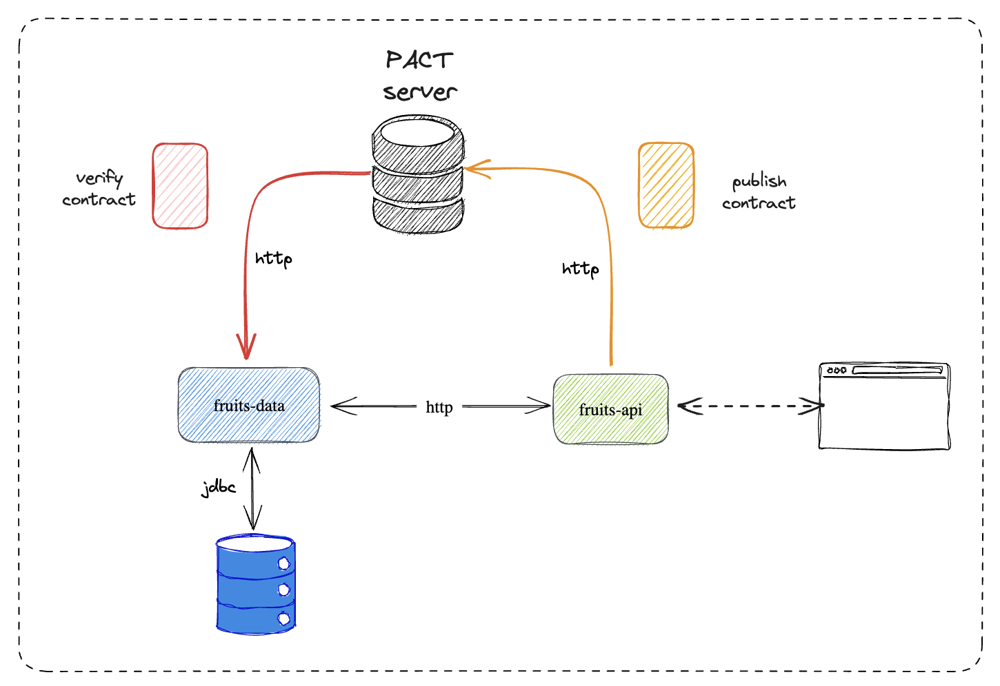

# quarkus-pact-sample

This project uses Quarkus, and shows how to implement contract testing using pact.

In this project we will add a contract tests to the existing architecture of sample Quarkus microservices. 
There are two sample apps that communicate with each other through HTTP. We use Quarkus declarative REST client 
to call remote HTTP endpoints. The quarkus-fruits-api app calls the endpoint exposed by the quarkus-fruits-data
app to get a list of fruits or find a specific one by id.

We will implement some contract tests to verify described interactions. Each contract is signed between 
two sides of communication: the consumer and the provider. Pact assumes that contract code is generated 
and published by the consumer side, and then verified by the provider side. 
It provides a tool for storing and sharing contracts between consumers and providers – Pact Broker. 
Pact Broker exposes a simple RESTful API for publishing and retrieving contracts, and an embedded 
web dashboard for navigating the API. We will run it as podman containers. 

Here’s the diagram that illustrates the described architecture.



## Running a podman PACT server

In order to work locally, we need an instance of a docker PACT server. For that we will execute the 
following podman commands:

1. First we need to create a podman network to link containers:

```shell script
podman network create pact_test
```

2. Provision a postgres database for persisting contract testing data:

```shell script
podman run -d --name postgres --net pact_test -p 5432:5432 -e POSTGRES_USER=pact -e POSTGRES_PASSWORD=pact123 -e POSTGRES_DB=pact postgres
```

3. Instantiate the pact server:

```shell script
podman run -d --name pact-broker --net pact_test -e PACT_BROKER_DATABASE_USERNAME=pact -e PACT_BROKER_DATABASE_PASSWORD=pact123 -e PACT_BROKER_DATABASE_HOST=postgres -e PACT_BROKER_DATABASE_NAME=pact -p 9292:9292 pactfoundation/pact-broker
```

We can also execute the following docker-compose file:

```
version: "3.7"
services:
  postgres:
    container_name: postgres
    image: postgres
    environment:
      POSTGRES_USER: pact
      POSTGRES_PASSWORD: pact123
      POSTGRES_DB: pact
    ports:
      - "5432"
  pact-broker:
    container_name: pact-broker
    image: pactfoundation/pact-broker
    ports:
      - "9292:9292"
    depends_on:
      - postgres
    links:
      - postgres
    environment:
      PACT_BROKER_DATABASE_USERNAME: pact
      PACT_BROKER_DATABASE_PASSWORD: pact123
      PACT_BROKER_DATABASE_HOST: postgres
      PACT_BROKER_DATABASE_NAME: pact
  
```

Once the PACT server is up and running we can check everything is ok, just searching:

```
http://localhost:9292
```

## Running the application in dev mode

You can run your application in dev mode that enables live coding using:

```shell script
podman-compose up -d
```

Before executing our application, we also need to provision a postgres database por persisting fruits data:

```shell script
podman run -d --name db-fruits --net pact_test -e POSTGRES_USER=quarkus_test -e POSTGRES_PASSWORD=quarkus_test -e POSTGRES_DB=quarkus_test -p 5435:5432 postgres
```

```shell script
./mvnw compile -DskipTests quarkus:dev
```

## Related Guides

Quarkus guide: https://piotrminkowski.com/2023/05/09/contract-testing-with-quarkus-and-pact/